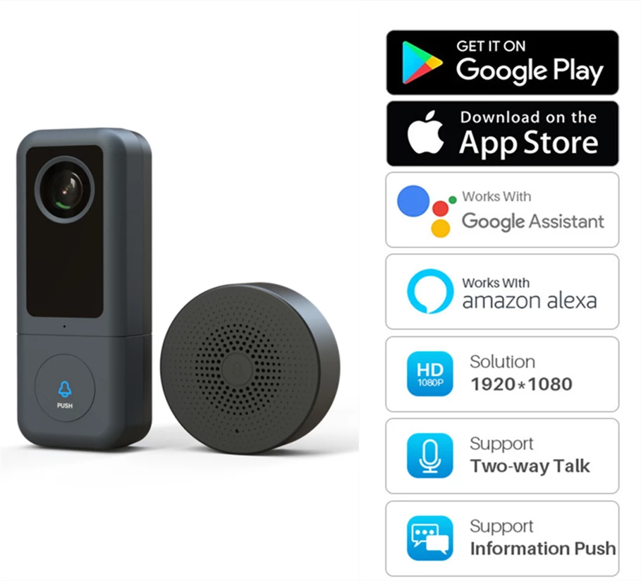

# My Home Assistant Configuration
I'm maintaining this more as a way of reminding myself what hardware I'm using, and where I bought it.
(And also for reminding me what I'm planning to use other hardware for)

This all started off when we bought our new home and had a Hive system installed for controlling our heating.
I bought a light bulb, and power socket that could also be controlled with it, then I just kept adding to it.

The problem with Hive was/is that latency sucks - even with the plug and bulbs being locally controlled via the Hive Hub over a radio based protocol called
zigbee - communicating with the Hub via the Hive app on my phone required internet based comms to an AWS hosted server. Gotta hate it when servers go down...

Home Assistant is a much more local solution that doesn't require IoT comms, unless you want it to - and so I got hooked :-)

## Hardware ##
I'm running Home Assistant on a 4GB Raspberry PI 4 model B, with a 64 GB SD card, using a [Conbee II usb stick](https://phoscon.de/en/conbee2) for integrating/controlling Zigbee lights, plugs, and sensors.

Some of the plugs have power monitoring, and I've automations set up to send me messages when the dishwasher, washing machine and tumble dryer have finished. These are mostly gleaned from
Phil Hawthorne's excellent [Making ‘dumb’ Dishwashers and Washing Machines Smart: Alerts When the Dishes and Clothes Are Cleaned](https://philhawthorne.com/making-dumb-dishwashers-and-washing-machines-smart-alerts-when-the-dishes-and-clothes-are-cleaned/) article. He also wrote a great article on [managing your shopping list with Grocy and Home Assistant](https://philhawthorne.com/automating-your-shopping-list-with-home-assistant-and-grocy/).

### Wifi ###
| Model | Buy | Image | Notes |
|------|----| ------ |-------- |
| Video Doorbell 2K HD with Intercom | [AliExpress](https://www.aliexpress.com/item/4001286888185.html) |  | Doorbell, powered via existing doorbell wiring (12/24v), no subscription required. Configure Onvif access through it's own app, and then access on port 8000 through Home Assistant. This got damaged and while it is still usable, I will be replacing it with a [Reolink doorbell](https://reolink.com/ie/product/reolink-video-doorbell-wifi/) which has better support in Home Assistant. |

###  🐝 Zigbee ###

####  Sensors ####
| Model                                                        | Zigbee Device Compatibility Reference  | Buy  | Image                                                                              | Quantity | Notes                                                        | Battery Type |
|--------------------------------------------------------------|------|------|------------------------------------------------------------------------------------|----------|--------------------------------------------------------------|--------|
| Aqara human body movement and illuminance sensor  |  [RTCGQ11LM](https://zigbee.blakadder.com/Aqara_RTCGQ11LM.html)    | [AliExpress](https://www.aliexpress.com/item/Aqara-Human-Body-Sensor-Smart-Body-Movement-PIR-Motion-Sensor-ZigBee-Wireless-Connection-Aqara-Sensor-For/4001230659983.html)     |            | 6        | Used to detect motion, and occupancy - lights turn on/off accordingly.  | CR2450 |
| Aqara P1 human body movement and illuminance sensor, upgraded, more configurable, version  |  [RTCGQ14LM](https://zigbee.blakadder.com/Aqara_RTCGQ14LM.html)    | [Amazon](https://www.amazon.co.uk/dp/B0B9XZ1D51)     |            | 1        | Used to detect motion, and occupancy - lights turn on/off accordingly.  | CR2450 |
| Aqara door & window contact sensor                | [MCCGQ11LM](https://zigbee.blakadder.com/Aqara_MCCGQ11LM.html)     | [AliExpress](https://www.aliexpress.com/item/1005001694843048.html)      |       | 10        | Turn lights on/off when doors are opened, closed etc. | CR1632 |
| Aqara light sensors                               | [GZCGQ11LM](https://zigbee.blakadder.com/Aqara_GZCGQ11LM.html)     | [AliExpress](https://www.aliexpress.com/item/1-10pcs-Xiaomi-Mijia-Smart-Light-Sensor-Zigbee-3-0-Light-Detection-Intelligent-Linkage-Waterproof-Used/1005001627142486.html)     |  | 4        | The PIR sensors only take illuminance readings when motion or occupancy is detected. These give continuous readings, so non-PIR based automations can factor in these readings. | CR2450 |
| Aqara Temperature, Humidity and Pressure Sensors | [WSDCGQ11LM](https://zigbee.blakadder.com/Aqara_WSDCGQ11LM.html)     | [AliExpress](https://www.aliexpress.com/item/4000713849766.html)     |  | 5        | Mostly informational, but also sends a message suggesting the ensuite window if the humidity is over 75% (after having a shower), and also to turn off relevant convection heaters if rooms have gotten too warm.| CR2032 |

####  Switches ####
| Model                                                        | Zigbee Device Compatibility Reference  | Buy  | Image                                                                              | Quantity | Notes                                                        | Battery Type |
|--------------------------------------------------------------|------|------|------------------------------------------------------------------------------------|----------|--------------------------------------------------------------|----|
| Sonoff Wireless Switch    | [SNZB-01](https://zigbee.blakadder.com/Sonoff_SNZB-01.html) | [AliExpress](https://www.aliexpress.com/item/1005001726907261.html) | | 1 | Switch for bedside lamp.  There are three separate types of events: single click, double click, and long click - I have these mapped to on, toggle and off respectively.  [EventSensor](https://github.com/azogue/eventsensor) integration in HACS can be used to make this work under ZHA -  [additional notes on using EventSensor here](https://community.home-assistant.io/t/unable-to-pair-sonoff-zigbee-snzb-01-wb-01-buttons/218324/19), along with some on how to integrate natively. | CR2450 |
| IKEA Tradfri Remote Control | [E1810](https://zigbee.blakadder.com/Ikea_E1810.html)| [Ikea](https://www.ikea.com/ie/en/p/tradfri-remote-control-30443124/)| | 2 | Living Room and Guest room lights, configured using [this Blueprint](https://my.home-assistant.io/redirect/blueprint_import/?blueprint_url=https%3A%2F%2Fcommunity.home-assistant.io%2Ft%2Fzha-ikea-five-button-remote-for-lights%2F253804)| CR2032 |
| IKEA Styrbar Remote Control | [E2001](https://zigbee.blakadder.com/Ikea_E2001.html)| [Ikea](https://www.ikea.com/ie/en/p/styrbar-remote-control-white-60488366/)| | 1 | Switch for ensuite light. | AAA battery x 4 |

####  Power plugs/monitoring ####
| Model                                                        | Zigbee Device Compatibility Reference      | Buy      | Image                                                                              | Quantity | Notes                                                        |
| ------------------------------------------------------------ |----- |----- | ---------------------------------------------------------------------------------- | -------- | ------------------------------------------------------------ |
| Heiman Power Monitoring Plug                             | [HS2SK](https://zigbee.blakadder.com/Heiman_HS2SK.html)     | [AliExpress](https://www.aliexpress.com/item/Heiman-Zigbee-Power-Metering-Plug-EU-UK-US-Wall-socket-Control-Power-On-off-For-Smart/32839165490.html)     |     | 2        | Monitor washing machine and tumbledryer, notify me when finished |
| Hive Plug                                                  | [1613V](https://zigbee.blakadder.com/Hive_1613V.html)     | [Amazon.co.uk](https://www.amazon.co.uk/Hive-ICESMRTPLUG-Active-Smart-Plug/dp/B01N7L53TB/)     |       | 1        | Monitor dishwasher, notify me when finished. Way more expensive than Heiman. Oddly Hive's app doesn't make use of the power monitoring feature on the plug, and they don't market the plug as having this feature. |
| Lidl/SilverCrest Plug                            | [HG06337-SB](https://zigbee.blakadder.com/Lidl_HG06337-BS.html)     |      |  | 6        | Bedside lamps, heaters, kettle |
| Lidl/SilverCrest power strip   3 plugs                 | [HG06338](https://zigbee.blakadder.com/Lidl_HG06338.html)     |      |     | 3        | One in my study for external monitors, laptop charger, and USB hub. One in bedroom for TV and convection heater.  Another for Christmas tree lights. |

####  Miscellaneous ####

| Model                                                        | Zigbee Device Compatibility Reference      | Buy      | Image                                                                              | Quantity | Notes                                                        |
| ------------------------------------------------------------ |----- |----- | ---------------------------------------------------------------------------------- | -------- | ------------------------------------------------------------ |
| Tuya Leak Detector | TS0207 | [AliExpress](https://www.aliexpress.com/item/1005004856008062.html)     | | 2        | Notify if leaks detected in laundry room/at dishwasher |
| Aqara Leak Detector | [SJCGQ11LM](https://zigbee.blakadder.com/Aqara_SJCGQ11LM.html)| [Amazon](https://www.amazon.co.uk/dp/B07D39MSZS)     | | 1        | Detect if the shower is being used - to ensure the light doesn't get switched off! :D |

####  Lighting ####

| Model                   | Zigbee Device Compatibility Reference      | Buy     | Image                                                                                        | Quantity | Notes                                                            |
| ------------------------|------|------|--------------------------------------------------------------------------------------------- | -------- | -------------------------------------------------------------- |
|  RGBW B22 Bulb          | [ZAH-BL01-RGBCW](https://zigbee.blakadder.com/eWeLight_ZAH-BL01-RGBCW.html)    | [eWeLight, RGBW B22 Bulb](https://www.aliexpress.com/item/1005002483909414.html)      |          | 3        | Study, landing, and cat room lights.                                     |
| Eglo Dimmable Warm White Vintage styled E27 Bulb  | [TLSR82xx](https://zigbee.blakadder.com/AwoX_33948.html)  | [Amazon.co.uk](https://www.amazon.co.uk/-/en/gp/product/B09FTBSCGW/ref=ppx_yo_dt_b_asin_title_o00_s00?ie=UTF8&th=1)     |   | 2        | Lights in kitchen.   |
| ERIA Smart Dimmable Warm White B22 Light Bulb | [Eria Smart Dimmable Warm White B22 Light Bulb](https://connectit.ie/products/smart-dimmable-warm-white-b22-light-bulb-eria-a60-9w) | [AduroSmart_81810](https://zigbee.blakadder.com/AduroSmart_81810.html) |  | 2 | Main light for guest room, and also for en-suite. |
| Hive Dimmable B22 Bulb  | [HALIGHTDIMWWB22](https://zigbee.blakadder.com/Hive_HALIGHTDIMWWB22.html)     | [Amazon.co.uk](https://www.amazon.co.uk/Hive-Lights-Dimmable-Bayonet-Smart/dp/B01I3T67EC/)     |       | 5        | Lights in hall, landing, laundry room  and cloakroom.   |
| Lidl Livarno Home outdoor floodlight | [HG08010](https://zigbee.blakadder.com/Lidl_HG08010.html)     | |       | 1        | Floodlight for back garden. On when the patio door is opened at night-time, off when it's closed.|

## Software ##

###  Integrations ###
These are some of the integrations that I have set up for either day-to-day or occasional use.

#### [AVM Fritz!Box Tools](https://www.home-assistant.io/integrations/fritz/) ####
Used for presence detection, and for remotely rebooting/reconnecting the Internet connection.

#### [EventSensor](https://github.com/azogue/eventsensor) ####
Installed via HACS and used to make the Sonoff wireless switch events show as distinct/eaiser debugged in the Logbook -
[additional notes on using EventSensor here](https://community.home-assistant.io/t/unable-to-pair-sonoff-zigbee-snzb-01-wb-01-buttons/218324/19), along with some on how to integrate natively. 

#### [Hive](https://www.home-assistant.io/integrations/hive/) ####
Used for controlling the Hive thermostats/heating. I can display when the water/heating was last on in Home Assistant, which is not possible in the native Hive app on my phone.

#### [HP Printer](https://github.com/elad-bar/ha-hpprinter) ####
Ink levels, and also number of pages printed and scanned.

#### [Garbage Collection](https://github.com/bruxy70/Garbage-Collection) ####
Sensor for notifications of scheduled collections, extremely configurable and
very hard to notice which is just what I need.

Just set up one entity for each separate type of collection (e.g. one for
compost day, and another for recycling if they're not collected on the same
day) and set the recurrence rules and icon/display accordingly.

#### [Met Eireann](https://www.home-assistant.io/integrations/met_eireann/) ####
Uses the Irish Meteorological Service weather forecast API to display weather
information in Home Assistant.

#### [Workday](https://www.home-assistant.io/integrations/workday/) ####
I'm using the Workday binary sensor integration so that work related
automations only get triggered on days that I'm supposed to be working on -
e.g. standard work week with Bank Holidays taken into consideration.
This means that monitors don't get turned on automatically on weekends or any
other day when I shouldn't need them.

## To do / More ideas ##
  * Door sensor on the letterbox. 
  * Add door sensor and lights for the attic.
  * Pause/restart robovac in the kitchen when motion detected. 
  
